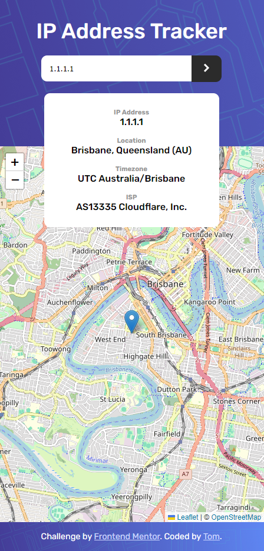

# IP Address Tracker

The IP Address Tracker is a web application that allows users to enter an IP address, fetches related geolocation data (such as country, region, city, and ISP), and displays this data along with the location on an interactive map. The app also fetches the user's IP location automatically on initial load. Built with JavaScript and Node.js, this project demonstrates fetching and displaying location data in real-time with an easy-to-use interface.

Thank you to Frontend Mentor for the [challenge and resources](https://www.frontendmentor.io/challenges/ip-address-tracker-I8-0yYAH0).

<!-- #todo: Live Demo -->

- [Live Demo](https://your-live-demo-link.com)

## Table of Contents

- [Screenshots](#screenshots)
- [Folder Structure](#folder-structure)
- [My Process](#my-process)
- [Built With](#built-with)
- [What I Learned](#what-i-learned)
- [Useful Resources](#useful-resources)
- [Continued Development](#continued-development)
- [Installation](#installation)
- [Author](#author)

---

## Screenshots

| mobile                                    | desktop                                     |
| ----------------------------------------- | ------------------------------------------- |
|  |  |

## Folder Structure

```
IP-Address-Tracker/
├── public/
│   ├── images/                # Image folder
│   ├── index.html             # Main HTML file
│   ├── app.js                 # Main JavaScript file
│   └── style.css              # Main styling file
├── .env                       # Environment variables for secret API keys
├── index.js                   # Express server and API route
└── package.json               # Project metadata and dependencies
```

## My Process

1. **Planning & Setup**: Defined core functionalities (IP data fetching, map display), set up Node.js with Express server, and created environment variables to securely store the API token.
2. **Frontend Development**: Implemented UI structure in `index.html` and styling in `style.css`, then connected the OpenStreetMap to display dynamic location markers.
3. **Backend Development**: Used Express to create an endpoint to securely fetch data from the `ipinfo.io` API, proxying requests and securing the API token with `dotenv`.
4. **Testing & Debugging**: Tested different IP addresses and adjusted error handling to ensure robustness for invalid input and API response errors.
5. **Documentation**: Added inline code comments and structured this `README.md` to explain the project structure and purpose.

## Built With

- **Frontend**: HTML, CSS, JavaScript, [Leaflet.js](https://leafletjs.com/) for interactive maps
- **Backend**: Node.js, Express
- **API**: [ipinfo.io](https://ipinfo.io) for IP geolocation data
- **Tools**: [nodemon](https://www.npmjs.com/package/nodemon), `.env` for API token security

## What I Learned

- **Encapsulation in JavaScript**: Encapsulated map marker updates within a factory function (`createMapAndIPDataUpdater`) to manage the current marker state and avoid multiple markers being rendered.
- **Secure API Usage**: Leveraged `.env` to securely store the API token, preventing sensitive information from being exposed in the frontend.
- **Asynchronous JavaScript**: Practiced `async/await` syntax for handling fetch requests and managing the UI updates in a fluid, non-blocking manner.

## Useful Resources

- [Frontend Mentor](https://www.frontendmentor.io/challenges/ip-address-tracker-I8-0yYAH0) - Challenge inspiration and design reference
- [Leaflet Documentation](https://leafletjs.com/reference.html) - Useful for implementing map and markers
- [MDN Web Docs on async/await](https://developer.mozilla.org/en-US/docs/Learn/JavaScript/Asynchronous/Async_await) - Helped in understanding asynchronous functions and error handling
- [dotenv GitHub Repository](https://github.com/motdotla/dotenv) - Useful for learning environment variable configuration

## Continued development

### 1. Folder Structure for API Logic (like Routing)

To keep the structure organized and scalable, consider placing API logic (such as the `ipinfo` route) in a separate file within a folder like `routes` or `controllers`. This approach modularizes code and makes maintenance easier:

```js
// ./routes/api.js

const express = require('express');
const router = express.Router();

router.get('/ipinfo', async (req, res) => {
  /_ ... _/;
});

module.exports = router;
```

- Then, in `index.js`, you could include this route:

```js
// index.js

const apiRoutes = require('./routes/api');
app.use('/api', apiRoutes);
```

### 2. Additional Data Points

Incorporate additional information such as approximate population of the location, ISP rating, or threat level.

## Installation

<!-- #todo: github repo -->
<!-- #todo: test the installation -->

1. Clone the repository:

   ```bash
   git clone https://github.com/TomUlrich/IP-Address-Tracker
   ```

2. Navigate into the project directory:

   ```bash
   cd IP-Address-Tracker
   ```

3. Install dependencies:

   ```bash
   npm install
   ```

4. Set up the environment variables:

   - Create a `.env` file in the root directory.
   - Add your `ipinfo.io` API token:

   ```
   IPINFO_API_TOKEN=your_api_token_here
   ```

5. Run the application:

   ```bash
   npm start
   ```

6. Open your browser and go to `http://localhost:3000`.

## Author

<!-- #todo:- Website - [Add your name here](https://www.your-site.com) -->

- GitHub - [@TomUlrich](https://github.com/TomUlrich)
